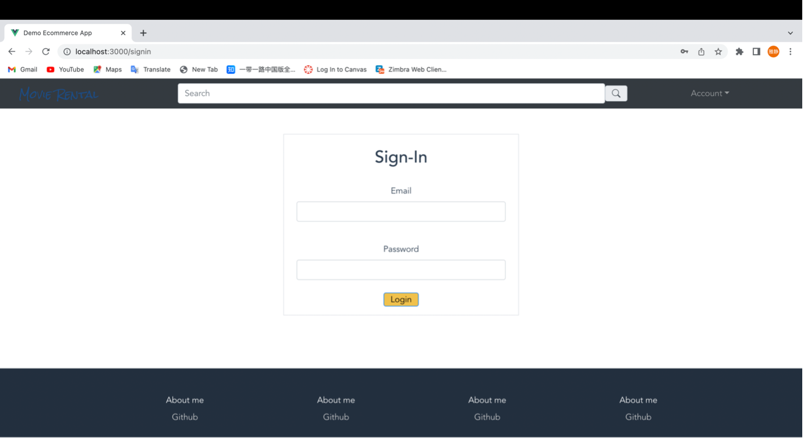

## Introduction

This prototype project is a frontend and backend separate website for providing online movie services. It has some basic functions like registering, login in, listing all movies, listing details of a movie, adding a new movie, editing an existing movie, deleting an existing movie, and searching for a movie. 

This project is an individual project for the class Comp413 Enterprise System and Application Development. I followed the [online tutorials](https://www.youtube.com/playlist?list=PLzXSm2gSfuPJtCgYJRJdB2hpP3gz73Dvc) and made some changes based on my understanding. 

## Design

In this chapter, the design ideas of this project are introduced hierarchically. In the high-level design section, the major techniques and tools used and the Model-View-Controller software architecture pattern are defined. In the low-level design section, the sitemap, class diagram, ER diagram, data definition language scripts, and data manipulation language scripts are introduced separately.

### Major Techniques and Tools Used

Since this project is frontend and backend separated, different techniques and tools are used in these two parts:

- **Frontend**:
  - **HTML**, **CSS**, **JavaScript**
  - **Vue.js**: This framework is used to handle users’ inputs and present the results to users. The reason why choosing this framework is that it is a lightweight but high-performance framework in web development, and it is easy to learn. 
  - **Bootstrap**: This framework is used to have a nice-looking user interface. This framework is chosen because there are abundant ready-made designs, and it is convenient to use them directly.
- **Backend**:
  - **Java**
  - **Spring Boot**: This framework is used to handle users’ requests, interact with the database, and send back the responses. This framework is chosen because it is easy to develop and reduces development time. 
  - **MySQL**

### Model-View-Controller Software Architecture Pattern

This project follows the model-view-controller (MVC) software architecture pattern. In other words, this project is divided into three parts – model (the database and the interactive actions with the database), view (user interfaces handling users’ inputs and presenting the results), and controller (accepting inputs and converting them into commands for the model or view). By using this software architecture pattern, different parts of this project can be developed more independently, which is convenient for future expansion or maintenance.

The whole project structure is shown below. To be more specific, the frontend folder represents the frontend, while the main folder represents the backend. In the frontend part, Vue files under frontend folder are used to represent the view part in MVC pattern. In the backend part, the java files under the controller folder and service folder are used to represent the controller part in MVC pattern. And the java files under the repository folder, dto folder and model folder are used to represent the model part in MVC pattern.


### Sitemap

This section introduces the frontend (view) in detail by using the sitemap below. 


### Class Diagram

This section introduces the backend (model and controller) in detail by using the class diagram below. (This class diagram is generated by IntelliJ IDEA. There are two block types in this diagram – Class (C) and Interface (I). The block can be divided into three parts – constructors, fields and methods. And in every block, the green lock represents public (‘+’) and the red lock represents private (‘-’).)


### Entity Relationship Diagram

This section shows the structures of the database by using the Entity Relationship diagram below.


### Data Definition Language Scripts

This section defines the data definition language scripts.

```SQL
CREATE TABLE `movie` (
  `id` int NOT NULL AUTO_INCREMENT,
  `cost_production` varchar(255) DEFAULT NULL,
  `description` varchar(255) DEFAULT NULL,
  `director` varchar(255) DEFAULT NULL,
  `genre` varchar(255) DEFAULT NULL,
  `image_url` varchar(255) DEFAULT NULL,
  `leading_actor` varchar(255) DEFAULT NULL,
  `length` varchar(255) DEFAULT NULL,
  `rental_price` varchar(255) DEFAULT NULL,
  `revenue` varchar(255) DEFAULT NULL,
  `studio` varchar(255) DEFAULT NULL,
  `title` varchar(255) DEFAULT NULL,
  `year` varchar(255) DEFAULT NULL,
  PRIMARY KEY (`id`)
) ENGINE=InnoDB AUTO_INCREMENT=6 DEFAULT CHARSET=utf8mb4 COLLATE=utf8mb4_0900_ai_ci;

CREATE TABLE `tokens` (
  `id` int NOT NULL AUTO_INCREMENT,
  `created_date` datetime(6) DEFAULT NULL,
  `token` varchar(255) DEFAULT NULL,
  `user_id` int NOT NULL,
  PRIMARY KEY (`id`),
  KEY `FKgh73xiagbl0no2bm4i7q29isu` (`user_id`),
  CONSTRAINT `FKgh73xiagbl0no2bm4i7q29isu` FOREIGN KEY (`user_id`) REFERENCES `user` (`id`)
) ENGINE=InnoDB AUTO_INCREMENT=2 DEFAULT CHARSET=utf8mb4 COLLATE=utf8mb4_0900_ai_ci;

CREATE TABLE `user` (
  `id` int NOT NULL AUTO_INCREMENT,
  `email` varchar(255) DEFAULT NULL,
  `first_name` varchar(255) DEFAULT NULL,
  `last_name` varchar(255) DEFAULT NULL,
  `password` varchar(255) DEFAULT NULL,
  PRIMARY KEY (`id`)
) ENGINE=InnoDB AUTO_INCREMENT=2 DEFAULT CHARSET=utf8mb4 COLLATE=utf8mb4_0900_ai_ci;

```

### Data Manipulation Language 

This section defines the data manipulation language scripts.

```SQL
INSERT INTO `movie` (`id`, `cost_production`, `description`, `director`, `genre`, `image_url`, `leading_actor`, `length`, `rental_price`, `revenue`, `studio`, `title`, `year`) VALUES
(3, '25,000,000', 'It tells the story of banker Andy Dufresne (Tim Robbins), who is sentenced to life in Shawshank State Penitentiary for the murders of his wife and her lover, despite his claims of innocence.', 'Frank Darabont', 'Crime Movie', 'https://upload.wikimedia.org/wikipedia/en/8/81/ShawshankRedemptionMoviePoster.jpg', 'Frank Darabont', '142', '10', '73,300,000', 'Columbia Pictures', 'The Shawshank Redemption', '1994'),
(4, 'Unknown', 'It chronicles the troubled relationships between two Peking opera actors and lifelong friends Cheng Dieyi (Cheung) and Duan Xiaolou (Zhang), and Xiaolou\'s wife Juxian (Gong).', 'Chen Kaige', 'Romance', 'https://upload.wikimedia.org/wikipedia/en/c/c5/Farewell_My_Concubine_poster.jpg', 'Leslie Cheung', '171', '6', '5,200,000', 'Miramax Films ', 'Farewell My Concubine', '1993'),
(5, '1,500,000', 'The story follows the misadventures of Chaplin\'s Tramp as he falls in love with a blind girl (Virginia Cherrill) and develops a turbulent friendship with an alcoholic millionaire (Harry Myers).', 'Charlie Chaplin', 'Comedy', 'https://upload.wikimedia.org/wikipedia/commons/thumb/0/09/City_Lights_%281931_theatrical_poster_-_retouched%29.jpg/440px-City_Lights_%281931_theatrical_poster_-_retouched%29.jpg', 'Charlie Chaplin', '87', '5', '4,250,000', 'United Artists', 'City Lights', '1931');

INSERT INTO `tokens` (`id`, `created_date`, `token`, `user_id`) VALUES
(1, '2022-11-28 20:32:33.721000', 'ae4c14ba-4bad-4ff7-8604-0fb5c1920675', 1);

INSERT INTO `user` (`id`, `email`, `first_name`, `last_name`, `password`) VALUES
(1, 'Liu@email.com', 'YJ', 'Liu', 'E10ADC3949BA59ABBE56E057F20F883E');
```

## User Interface Screenshot

This chapter shows the user interface screenshots. It can be divided into two parts – the functions about users (login and register) and the functions about movies (list all movies, list details of a movie, add a new movie, edit a movie, delete an existing movie, and search a movie).

### Functions about Users

#### Register

Users can press the sign-up button in the account list in the navigation bar and then they will see the web page for creating an account.


After inputting the information, users press the sign-up button, and then they will go to the home page and see an alert.


The user information is stored in database and the password is handled by hash algorithms MD5.


#### Login

Users can press the sign in button in account list in the navigation bar and then they will see the web page for login.



After inputting the information, users press the login button, and then they will go to the home page and see an alert.


### Functions about Movies

#### List All Movies

In the home page, users can slide the web page down or press the button ‘start renting movies’ to see all the movies.


#### List Movie Details

After seeing all the movies, users can press the title of one movie and then they will see the movie detail page.


#### Add New Movie

Users can press the admin in account list in the navigation bar, and then they will go to the admin page. They can press the ‘admin movie’ button to go to movie page. They can press the ‘add movie’ button in this page and go to add movie page.


After inputting the information of the movie, user can press the submit button and then they will go to the admin movie page and see an alert. After refreshing the web page, the new movie can be seen in the list.


#### Edit Movie

Users can press the edit button in every movie box, and then they will go to the edit movie page. After editing the movie information, users can press the button ‘edit movie’ and then they can see an alert and go to the movie detail page to see the edited movie.


#### Delete Movie

Users can go to the movie page and press the delete button in the movie box. And then they can see the alert. After refreshing, the deleted movie is disappeared.


#### Search Movie

Users can input the search words in the search box and then press the search button, and then they can see the searching results. 


